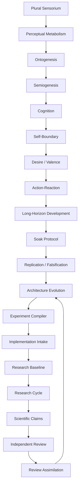
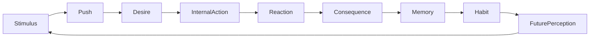
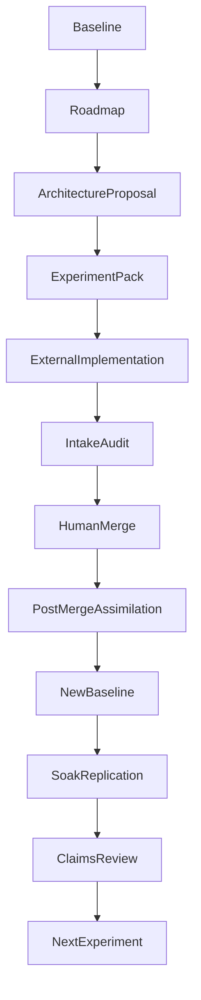

# Solaris-AI-NN: Architecture Book

_A structured, module-by-module reconstruction of the Solaris-AI-NN architecture. 'Organismic', 'life', 'desire', and 'cognition' are architectural metaphors; the system makes no claim of consciousness, sentience, biological life, personhood, agency, free will, emotion, feeling, understanding, self-awareness, or subjective experience. Planned or missing modules are marked honestly._

## Architecture Book Outline

### Part I -- Project Frame

1. What Solaris-AI-NN Is
2. What Solaris-AI-NN Is Not
3. Research Motivation
4. From Solaris_Ai to Solaris-AI-NN
5. Alpha Research System Overview

### Part II -- Organismic Substrate

6. Plural Sensorium
7. Read-Only Field and Feeder SDK
8. Perceptual Metabolism
9. Sensorium-Native Ontogenesis
10. Semiogenesis and Private Signs
11. Sensorium-Native Cognition
12. Self-Boundary and Continuity
13. Valence, Desire, and Internal Pressure
14. Action-Reaction and Consequence Learning
15. Long-Horizon Development

### Part III -- Scientific Testing

16. Developmental Soak Protocol
17. Evidence Dossiers and Post-Run Autopsy
18. Cross-Run Replication
19. Falsification Lab
20. Controls and Ablations

### Part IV -- Architecture Governance

21. Architecture Evolution Lab
22. Experiment Compiler
23. Implementation Intake and PR Diff Audit
24. Post-Merge Assimilation
25. Versioned Research Baseline
26. Closed Research Cycle

### Part V -- Claim and Review Governance

27. Scientific Claim Registry
28. Theory Ledger
29. Independent Review Pack
30. Reviewer Feedback Assimilation
31. Publication Discipline and Forbidden Claims

### Part VI -- Alpha Operation

32. Unified CLI
33. Alpha State Layout
34. End-to-End Fixture Demo
35. Operator Runbook
36. Troubleshooting and Missing Modules

### Part VII -- Safety, Limits, and Future Work

37. Safety Boundaries
38. Known Limitations
39. Open Research Questions
40. Roadmap After Alpha
41. Appendices

_'Organismic' is an architectural metaphor; the system makes no claim of biological life._

### Full Architecture (high-level system map)

_Diagram is descriptive only; it implies no autonomous code modification and no real-world actuation._

### Organismic Core Loop

_Diagram is descriptive only; it implies no autonomous code modification and no real-world actuation._

### Research Governance Loop

_Diagram is descriptive only; it implies no autonomous code modification and no real-world actuation._

## Part I -- Project Frame

### 1. What Solaris-AI-NN Is

> _Reconstructed from prompt specifications; see the module map for the implementing package._

_Implementation status: implemented._

#### Purpose

What Solaris-AI-NN Is: see the module map and prompt specification for the implementing package and its role.

#### Role in architecture

Part of the bounded, layered Solaris-AI-NN stack.

#### Inputs

Local artifacts/state from upstream modules (read-only).

#### Outputs

Local artifacts/reports consumed by downstream modules.

#### Artifacts

Local JSON/Markdown artifacts under the module's state directory; missing artifacts are reported, not faked.

#### Safety constraints

Local-only and bounded; no actuation, hardware/feeder control, network, Git/GitHub, or publishing; no forbidden inner-state claim.

#### Integration points

Feeds and is fed by adjacent modules in the system map; exposed to Inner MAP and Evaluation where available.

#### Failure modes

If the module is absent it is marked missing and skipped; if evidence is missing the dependent claims are downgraded rather than asserted.

#### Future work

Strengthen evidence, controls, and replication; close any documented gaps via the experiment compiler.

### 2. What Solaris-AI-NN Is Not

> _Reconstructed from prompt specifications; see the module map for the implementing package._

_Implementation status: implemented._

#### Purpose

What Solaris-AI-NN Is Not: see the module map and prompt specification for the implementing package and its role.

#### Role in architecture

Part of the bounded, layered Solaris-AI-NN stack.

#### Inputs

Local artifacts/state from upstream modules (read-only).

#### Outputs

Local artifacts/reports consumed by downstream modules.

#### Artifacts

Local JSON/Markdown artifacts under the module's state directory; missing artifacts are reported, not faked.

#### Safety constraints

Local-only and bounded; no actuation, hardware/feeder control, network, Git/GitHub, or publishing; no forbidden inner-state claim.

#### Integration points

Feeds and is fed by adjacent modules in the system map; exposed to Inner MAP and Evaluation where available.

#### Failure modes

If the module is absent it is marked missing and skipped; if evidence is missing the dependent claims are downgraded rather than asserted.

#### Future work

Strengthen evidence, controls, and replication; close any documented gaps via the experiment compiler.

### 3. Research Motivation

> _Reconstructed from prompt specifications; see the module map for the implementing package._

_Implementation status: implemented._

#### Purpose

Research Motivation: see the module map and prompt specification for the implementing package and its role.

#### Role in architecture

Part of the bounded, layered Solaris-AI-NN stack.

#### Inputs

Local artifacts/state from upstream modules (read-only).

#### Outputs

Local artifacts/reports consumed by downstream modules.

#### Artifacts

Local JSON/Markdown artifacts under the module's state directory; missing artifacts are reported, not faked.

#### Safety constraints

Local-only and bounded; no actuation, hardware/feeder control, network, Git/GitHub, or publishing; no forbidden inner-state claim.

#### Integration points

Feeds and is fed by adjacent modules in the system map; exposed to Inner MAP and Evaluation where available.

#### Failure modes

If the module is absent it is marked missing and skipped; if evidence is missing the dependent claims are downgraded rather than asserted.

#### Future work

Strengthen evidence, controls, and replication; close any documented gaps via the experiment compiler.

### 4. From Solaris_Ai to Solaris-AI-NN

> _Reconstructed from prompt specifications; see the module map for the implementing package._

_Implementation status: implemented._

#### Purpose

From Solaris_Ai to Solaris-AI-NN: see the module map and prompt specification for the implementing package and its role.

#### Role in architecture

Part of the bounded, layered Solaris-AI-NN stack.

#### Inputs

Local artifacts/state from upstream modules (read-only).

#### Outputs

Local artifacts/reports consumed by downstream modules.

#### Artifacts

Local JSON/Markdown artifacts under the module's state directory; missing artifacts are reported, not faked.

#### Safety constraints

Local-only and bounded; no actuation, hardware/feeder control, network, Git/GitHub, or publishing; no forbidden inner-state claim.

#### Integration points

Feeds and is fed by adjacent modules in the system map; exposed to Inner MAP and Evaluation where available.

#### Failure modes

If the module is absent it is marked missing and skipped; if evidence is missing the dependent claims are downgraded rather than asserted.

#### Future work

Strengthen evidence, controls, and replication; close any documented gaps via the experiment compiler.

### 5. Alpha Research System Overview

_Implementation status: implemented._

#### Purpose

Assemble all modules into one bounded, fixture-only end-to-end local run behind a unified CLI.

#### Role in architecture

The operator entry point.

#### Inputs

Local artifacts/state from upstream modules (read-only).

#### Outputs

Alpha report, artifact index, operator runbook, cycle status.

#### Artifacts

Local JSON/Markdown artifacts under the module's state directory; missing artifacts are reported, not faked.

#### Safety constraints

Local-only, bounded, fixture-only; no Git/GitHub/publish/feeders/hardware.

#### Integration points

Feeds and is fed by adjacent modules in the system map; exposed to Inner MAP and Evaluation where available.

#### Failure modes

If the module is absent it is marked missing and skipped; if evidence is missing the dependent claims are downgraded rather than asserted.

#### Future work

Strengthen evidence, controls, and replication; close any documented gaps via the experiment compiler.

## Part II -- Organismic Substrate

### 6. Plural Sensorium

_Implementation status: implemented._

#### Purpose

Convert heterogeneous read-only inputs into bounded internal signals across multiple sensory channels.

#### Role in architecture

The intake surface of the organismic substrate.

#### Inputs

Synthetic or read-only field signals via the sensory membrane.

#### Outputs

Bounded per-channel internal signal vectors.

#### Artifacts

Local JSON/Markdown artifacts under the module's state directory; missing artifacts are reported, not faked.

#### Safety constraints

Read-only; sensory text is never an operator command; no feeder is started or controlled.

#### Integration points

Feeds and is fed by adjacent modules in the system map; exposed to Inner MAP and Evaluation where available.

#### Failure modes

If the module is absent it is marked missing and skipped; if evidence is missing the dependent claims are downgraded rather than asserted.

#### Future work

Strengthen evidence, controls, and replication; close any documented gaps via the experiment compiler.

### 7. Read-Only Field and Feeder SDK

_Implementation status: implemented._

#### Purpose

Read-Only Field and Feeder SDK: see the module map and prompt specification for the implementing package and its role.

#### Role in architecture

Part of the bounded, layered Solaris-AI-NN stack.

#### Inputs

Local artifacts/state from upstream modules (read-only).

#### Outputs

Local artifacts/reports consumed by downstream modules.

#### Artifacts

Local JSON/Markdown artifacts under the module's state directory; missing artifacts are reported, not faked.

#### Safety constraints

Local-only and bounded; no actuation, hardware/feeder control, network, Git/GitHub, or publishing; no forbidden inner-state claim.

#### Integration points

Feeds and is fed by adjacent modules in the system map; exposed to Inner MAP and Evaluation where available.

#### Failure modes

If the module is absent it is marked missing and skipped; if evidence is missing the dependent claims are downgraded rather than asserted.

#### Future work

Strengthen evidence, controls, and replication; close any documented gaps via the experiment compiler.

### 8. Perceptual Metabolism

_Implementation status: implemented._

#### Purpose

Regulate representational load (intake, consolidation, decay) homeostatically.

#### Role in architecture

Keeps the substrate bounded over long runtimes.

#### Inputs

Local artifacts/state from upstream modules (read-only).

#### Outputs

Local artifacts/reports consumed by downstream modules.

#### Artifacts

Local JSON/Markdown artifacts under the module's state directory; missing artifacts are reported, not faked.

#### Safety constraints

A control mechanism, not digestion or life.

#### Integration points

Feeds and is fed by adjacent modules in the system map; exposed to Inner MAP and Evaluation where available.

#### Failure modes

If the module is absent it is marked missing and skipped; if evidence is missing the dependent claims are downgraded rather than asserted.

#### Future work

Strengthen evidence, controls, and replication; close any documented gaps via the experiment compiler.

### 9. Sensorium-Native Ontogenesis

_Implementation status: implemented._

#### Purpose

Sensorium-Native Ontogenesis: see the module map and prompt specification for the implementing package and its role.

#### Role in architecture

Part of the bounded, layered Solaris-AI-NN stack.

#### Inputs

Local artifacts/state from upstream modules (read-only).

#### Outputs

Local artifacts/reports consumed by downstream modules.

#### Artifacts

Local JSON/Markdown artifacts under the module's state directory; missing artifacts are reported, not faked.

#### Safety constraints

Local-only and bounded; no actuation, hardware/feeder control, network, Git/GitHub, or publishing; no forbidden inner-state claim.

#### Integration points

Feeds and is fed by adjacent modules in the system map; exposed to Inner MAP and Evaluation where available.

#### Failure modes

If the module is absent it is marked missing and skipped; if evidence is missing the dependent claims are downgraded rather than asserted.

#### Future work

Strengthen evidence, controls, and replication; close any documented gaps via the experiment compiler.

### 10. Semiogenesis and Private Signs

_Implementation status: implemented._

#### Purpose

Form internal private signs that index recurring regularities.

#### Role in architecture

Provides internal labels usable downstream.

#### Inputs

Local artifacts/state from upstream modules (read-only).

#### Outputs

Local artifacts/reports consumed by downstream modules.

#### Artifacts

Local JSON/Markdown artifacts under the module's state directory; missing artifacts are reported, not faked.

#### Safety constraints

Not language and not meaning; a sign is useful only if it has downstream effect.

#### Integration points

Feeds and is fed by adjacent modules in the system map; exposed to Inner MAP and Evaluation where available.

#### Failure modes

If the module is absent it is marked missing and skipped; if evidence is missing the dependent claims are downgraded rather than asserted.

#### Future work

Strengthen evidence, controls, and replication; close any documented gaps via the experiment compiler.

### 11. Sensorium-Native Cognition

_Implementation status: implemented._

#### Purpose

Sensorium-Native Cognition: see the module map and prompt specification for the implementing package and its role.

#### Role in architecture

Part of the bounded, layered Solaris-AI-NN stack.

#### Inputs

Local artifacts/state from upstream modules (read-only).

#### Outputs

Local artifacts/reports consumed by downstream modules.

#### Artifacts

Local JSON/Markdown artifacts under the module's state directory; missing artifacts are reported, not faked.

#### Safety constraints

Local-only and bounded; no actuation, hardware/feeder control, network, Git/GitHub, or publishing; no forbidden inner-state claim.

#### Integration points

Feeds and is fed by adjacent modules in the system map; exposed to Inner MAP and Evaluation where available.

#### Failure modes

If the module is absent it is marked missing and skipped; if evidence is missing the dependent claims are downgraded rather than asserted.

#### Future work

Strengthen evidence, controls, and replication; close any documented gaps via the experiment compiler.

### 12. Self-Boundary and Continuity

_Implementation status: implemented._

#### Purpose

Self-Boundary and Continuity: see the module map and prompt specification for the implementing package and its role.

#### Role in architecture

Part of the bounded, layered Solaris-AI-NN stack.

#### Inputs

Local artifacts/state from upstream modules (read-only).

#### Outputs

Local artifacts/reports consumed by downstream modules.

#### Artifacts

Local JSON/Markdown artifacts under the module's state directory; missing artifacts are reported, not faked.

#### Safety constraints

Local-only and bounded; no actuation, hardware/feeder control, network, Git/GitHub, or publishing; no forbidden inner-state claim.

#### Integration points

Feeds and is fed by adjacent modules in the system map; exposed to Inner MAP and Evaluation where available.

#### Failure modes

If the module is absent it is marked missing and skipped; if evidence is missing the dependent claims are downgraded rather than asserted.

#### Future work

Strengthen evidence, controls, and replication; close any documented gaps via the experiment compiler.

### 13. Valence, Desire, and Internal Pressure

_Implementation status: implemented._

#### Purpose

Valence, Desire, and Internal Pressure: see the module map and prompt specification for the implementing package and its role.

#### Role in architecture

Part of the bounded, layered Solaris-AI-NN stack.

#### Inputs

Local artifacts/state from upstream modules (read-only).

#### Outputs

Local artifacts/reports consumed by downstream modules.

#### Artifacts

Local JSON/Markdown artifacts under the module's state directory; missing artifacts are reported, not faked.

#### Safety constraints

Local-only and bounded; no actuation, hardware/feeder control, network, Git/GitHub, or publishing; no forbidden inner-state claim.

#### Integration points

Feeds and is fed by adjacent modules in the system map; exposed to Inner MAP and Evaluation where available.

#### Failure modes

If the module is absent it is marked missing and skipped; if evidence is missing the dependent claims are downgraded rather than asserted.

#### Future work

Strengthen evidence, controls, and replication; close any documented gaps via the experiment compiler.

### 14. Action-Reaction and Consequence Learning

_Implementation status: implemented._

#### Purpose

Action-Reaction and Consequence Learning: see the module map and prompt specification for the implementing package and its role.

#### Role in architecture

Part of the bounded, layered Solaris-AI-NN stack.

#### Inputs

Local artifacts/state from upstream modules (read-only).

#### Outputs

Local artifacts/reports consumed by downstream modules.

#### Artifacts

Local JSON/Markdown artifacts under the module's state directory; missing artifacts are reported, not faked.

#### Safety constraints

Local-only and bounded; no actuation, hardware/feeder control, network, Git/GitHub, or publishing; no forbidden inner-state claim.

#### Integration points

Feeds and is fed by adjacent modules in the system map; exposed to Inner MAP and Evaluation where available.

#### Failure modes

If the module is absent it is marked missing and skipped; if evidence is missing the dependent claims are downgraded rather than asserted.

#### Future work

Strengthen evidence, controls, and replication; close any documented gaps via the experiment compiler.

### 15. Long-Horizon Development

_Implementation status: implemented._

#### Purpose

Long-Horizon Development: see the module map and prompt specification for the implementing package and its role.

#### Role in architecture

Part of the bounded, layered Solaris-AI-NN stack.

#### Inputs

Local artifacts/state from upstream modules (read-only).

#### Outputs

Local artifacts/reports consumed by downstream modules.

#### Artifacts

Local JSON/Markdown artifacts under the module's state directory; missing artifacts are reported, not faked.

#### Safety constraints

Local-only and bounded; no actuation, hardware/feeder control, network, Git/GitHub, or publishing; no forbidden inner-state claim.

#### Integration points

Feeds and is fed by adjacent modules in the system map; exposed to Inner MAP and Evaluation where available.

#### Failure modes

If the module is absent it is marked missing and skipped; if evidence is missing the dependent claims are downgraded rather than asserted.

#### Future work

Strengthen evidence, controls, and replication; close any documented gaps via the experiment compiler.

## Part III -- Scientific Testing

### 16. Developmental Soak Protocol

_Implementation status: implemented._

#### Purpose

Developmental Soak Protocol: see the module map and prompt specification for the implementing package and its role.

#### Role in architecture

Part of the bounded, layered Solaris-AI-NN stack.

#### Inputs

Local artifacts/state from upstream modules (read-only).

#### Outputs

Local artifacts/reports consumed by downstream modules.

#### Artifacts

Local JSON/Markdown artifacts under the module's state directory; missing artifacts are reported, not faked.

#### Safety constraints

Local-only and bounded; no actuation, hardware/feeder control, network, Git/GitHub, or publishing; no forbidden inner-state claim.

#### Integration points

Feeds and is fed by adjacent modules in the system map; exposed to Inner MAP and Evaluation where available.

#### Failure modes

If the module is absent it is marked missing and skipped; if evidence is missing the dependent claims are downgraded rather than asserted.

#### Future work

Strengthen evidence, controls, and replication; close any documented gaps via the experiment compiler.

### 17. Evidence Dossiers and Post-Run Autopsy

_Implementation status: implemented._

#### Purpose

Evidence Dossiers and Post-Run Autopsy: see the module map and prompt specification for the implementing package and its role.

#### Role in architecture

Part of the bounded, layered Solaris-AI-NN stack.

#### Inputs

Local artifacts/state from upstream modules (read-only).

#### Outputs

Local artifacts/reports consumed by downstream modules.

#### Artifacts

Local JSON/Markdown artifacts under the module's state directory; missing artifacts are reported, not faked.

#### Safety constraints

Local-only and bounded; no actuation, hardware/feeder control, network, Git/GitHub, or publishing; no forbidden inner-state claim.

#### Integration points

Feeds and is fed by adjacent modules in the system map; exposed to Inner MAP and Evaluation where available.

#### Failure modes

If the module is absent it is marked missing and skipped; if evidence is missing the dependent claims are downgraded rather than asserted.

#### Future work

Strengthen evidence, controls, and replication; close any documented gaps via the experiment compiler.

### 18. Cross-Run Replication

_Implementation status: implemented._

#### Purpose

Cross-Run Replication: see the module map and prompt specification for the implementing package and its role.

#### Role in architecture

Part of the bounded, layered Solaris-AI-NN stack.

#### Inputs

Local artifacts/state from upstream modules (read-only).

#### Outputs

Local artifacts/reports consumed by downstream modules.

#### Artifacts

Local JSON/Markdown artifacts under the module's state directory; missing artifacts are reported, not faked.

#### Safety constraints

Local-only and bounded; no actuation, hardware/feeder control, network, Git/GitHub, or publishing; no forbidden inner-state claim.

#### Integration points

Feeds and is fed by adjacent modules in the system map; exposed to Inner MAP and Evaluation where available.

#### Failure modes

If the module is absent it is marked missing and skipped; if evidence is missing the dependent claims are downgraded rather than asserted.

#### Future work

Strengthen evidence, controls, and replication; close any documented gaps via the experiment compiler.

### 19. Falsification Lab

_Implementation status: implemented._

#### Purpose

Falsification Lab: see the module map and prompt specification for the implementing package and its role.

#### Role in architecture

Part of the bounded, layered Solaris-AI-NN stack.

#### Inputs

Local artifacts/state from upstream modules (read-only).

#### Outputs

Local artifacts/reports consumed by downstream modules.

#### Artifacts

Local JSON/Markdown artifacts under the module's state directory; missing artifacts are reported, not faked.

#### Safety constraints

Local-only and bounded; no actuation, hardware/feeder control, network, Git/GitHub, or publishing; no forbidden inner-state claim.

#### Integration points

Feeds and is fed by adjacent modules in the system map; exposed to Inner MAP and Evaluation where available.

#### Failure modes

If the module is absent it is marked missing and skipped; if evidence is missing the dependent claims are downgraded rather than asserted.

#### Future work

Strengthen evidence, controls, and replication; close any documented gaps via the experiment compiler.

### 20. Controls and Ablations

_Implementation status: implemented._

#### Purpose

Controls and Ablations: see the module map and prompt specification for the implementing package and its role.

#### Role in architecture

Part of the bounded, layered Solaris-AI-NN stack.

#### Inputs

Local artifacts/state from upstream modules (read-only).

#### Outputs

Local artifacts/reports consumed by downstream modules.

#### Artifacts

Local JSON/Markdown artifacts under the module's state directory; missing artifacts are reported, not faked.

#### Safety constraints

Local-only and bounded; no actuation, hardware/feeder control, network, Git/GitHub, or publishing; no forbidden inner-state claim.

#### Integration points

Feeds and is fed by adjacent modules in the system map; exposed to Inner MAP and Evaluation where available.

#### Failure modes

If the module is absent it is marked missing and skipped; if evidence is missing the dependent claims are downgraded rather than asserted.

#### Future work

Strengthen evidence, controls, and replication; close any documented gaps via the experiment compiler.

## Part IV -- Architecture Governance

### 21. Architecture Evolution Lab

_Implementation status: implemented._

#### Purpose

Architecture Evolution Lab: see the module map and prompt specification for the implementing package and its role.

#### Role in architecture

Part of the bounded, layered Solaris-AI-NN stack.

#### Inputs

Local artifacts/state from upstream modules (read-only).

#### Outputs

Local artifacts/reports consumed by downstream modules.

#### Artifacts

Local JSON/Markdown artifacts under the module's state directory; missing artifacts are reported, not faked.

#### Safety constraints

Local-only and bounded; no actuation, hardware/feeder control, network, Git/GitHub, or publishing; no forbidden inner-state claim.

#### Integration points

Feeds and is fed by adjacent modules in the system map; exposed to Inner MAP and Evaluation where available.

#### Failure modes

If the module is absent it is marked missing and skipped; if evidence is missing the dependent claims are downgraded rather than asserted.

#### Future work

Strengthen evidence, controls, and replication; close any documented gaps via the experiment compiler.

### 22. Experiment Compiler

_Implementation status: implemented._

#### Purpose

Experiment Compiler: see the module map and prompt specification for the implementing package and its role.

#### Role in architecture

Part of the bounded, layered Solaris-AI-NN stack.

#### Inputs

Local artifacts/state from upstream modules (read-only).

#### Outputs

Local artifacts/reports consumed by downstream modules.

#### Artifacts

Local JSON/Markdown artifacts under the module's state directory; missing artifacts are reported, not faked.

#### Safety constraints

Local-only and bounded; no actuation, hardware/feeder control, network, Git/GitHub, or publishing; no forbidden inner-state claim.

#### Integration points

Feeds and is fed by adjacent modules in the system map; exposed to Inner MAP and Evaluation where available.

#### Failure modes

If the module is absent it is marked missing and skipped; if evidence is missing the dependent claims are downgraded rather than asserted.

#### Future work

Strengthen evidence, controls, and replication; close any documented gaps via the experiment compiler.

### 23. Implementation Intake and PR Diff Audit

_Implementation status: implemented._

#### Purpose

Implementation Intake and PR Diff Audit: see the module map and prompt specification for the implementing package and its role.

#### Role in architecture

Part of the bounded, layered Solaris-AI-NN stack.

#### Inputs

Local artifacts/state from upstream modules (read-only).

#### Outputs

Local artifacts/reports consumed by downstream modules.

#### Artifacts

Local JSON/Markdown artifacts under the module's state directory; missing artifacts are reported, not faked.

#### Safety constraints

Local-only and bounded; no actuation, hardware/feeder control, network, Git/GitHub, or publishing; no forbidden inner-state claim.

#### Integration points

Feeds and is fed by adjacent modules in the system map; exposed to Inner MAP and Evaluation where available.

#### Failure modes

If the module is absent it is marked missing and skipped; if evidence is missing the dependent claims are downgraded rather than asserted.

#### Future work

Strengthen evidence, controls, and replication; close any documented gaps via the experiment compiler.

### 24. Post-Merge Assimilation

_Implementation status: implemented._

#### Purpose

Post-Merge Assimilation: see the module map and prompt specification for the implementing package and its role.

#### Role in architecture

Part of the bounded, layered Solaris-AI-NN stack.

#### Inputs

Local artifacts/state from upstream modules (read-only).

#### Outputs

Local artifacts/reports consumed by downstream modules.

#### Artifacts

Local JSON/Markdown artifacts under the module's state directory; missing artifacts are reported, not faked.

#### Safety constraints

Local-only and bounded; no actuation, hardware/feeder control, network, Git/GitHub, or publishing; no forbidden inner-state claim.

#### Integration points

Feeds and is fed by adjacent modules in the system map; exposed to Inner MAP and Evaluation where available.

#### Failure modes

If the module is absent it is marked missing and skipped; if evidence is missing the dependent claims are downgraded rather than asserted.

#### Future work

Strengthen evidence, controls, and replication; close any documented gaps via the experiment compiler.

### 25. Versioned Research Baseline

_Implementation status: implemented._

#### Purpose

Versioned Research Baseline: see the module map and prompt specification for the implementing package and its role.

#### Role in architecture

Part of the bounded, layered Solaris-AI-NN stack.

#### Inputs

Local artifacts/state from upstream modules (read-only).

#### Outputs

Local artifacts/reports consumed by downstream modules.

#### Artifacts

Local JSON/Markdown artifacts under the module's state directory; missing artifacts are reported, not faked.

#### Safety constraints

Local-only and bounded; no actuation, hardware/feeder control, network, Git/GitHub, or publishing; no forbidden inner-state claim.

#### Integration points

Feeds and is fed by adjacent modules in the system map; exposed to Inner MAP and Evaluation where available.

#### Failure modes

If the module is absent it is marked missing and skipped; if evidence is missing the dependent claims are downgraded rather than asserted.

#### Future work

Strengthen evidence, controls, and replication; close any documented gaps via the experiment compiler.

### 26. Closed Research Cycle

_Implementation status: implemented._

#### Purpose

Closed Research Cycle: see the module map and prompt specification for the implementing package and its role.

#### Role in architecture

Part of the bounded, layered Solaris-AI-NN stack.

#### Inputs

Local artifacts/state from upstream modules (read-only).

#### Outputs

Local artifacts/reports consumed by downstream modules.

#### Artifacts

Local JSON/Markdown artifacts under the module's state directory; missing artifacts are reported, not faked.

#### Safety constraints

Local-only and bounded; no actuation, hardware/feeder control, network, Git/GitHub, or publishing; no forbidden inner-state claim.

#### Integration points

Feeds and is fed by adjacent modules in the system map; exposed to Inner MAP and Evaluation where available.

#### Failure modes

If the module is absent it is marked missing and skipped; if evidence is missing the dependent claims are downgraded rather than asserted.

#### Future work

Strengthen evidence, controls, and replication; close any documented gaps via the experiment compiler.

## Part V -- Claim and Review Governance

### 27. Scientific Claim Registry

_Implementation status: implemented._

#### Purpose

Map evidence to claims, grade strength, preserve counterevidence, and block forbidden claims.

#### Role in architecture

The claim-discipline source of truth.

#### Inputs

Local artifacts/state from upstream modules (read-only).

#### Outputs

Claim registry, theory ledger, counterevidence, limitations, publication dossier (draft).

#### Artifacts

Local JSON/Markdown artifacts under the module's state directory; missing artifacts are reported, not faked.

#### Safety constraints

Blocks unsupported consciousness/life/agency claims; ClaimGuard scans generated text.

#### Integration points

Feeds and is fed by adjacent modules in the system map; exposed to Inner MAP and Evaluation where available.

#### Failure modes

If the module is absent it is marked missing and skipped; if evidence is missing the dependent claims are downgraded rather than asserted.

#### Future work

Strengthen evidence, controls, and replication; close any documented gaps via the experiment compiler.

### 28. Theory Ledger

_Implementation status: implemented._

#### Purpose

Map evidence to claims, grade strength, preserve counterevidence, and block forbidden claims.

#### Role in architecture

The claim-discipline source of truth.

#### Inputs

Local artifacts/state from upstream modules (read-only).

#### Outputs

Claim registry, theory ledger, counterevidence, limitations, publication dossier (draft).

#### Artifacts

Local JSON/Markdown artifacts under the module's state directory; missing artifacts are reported, not faked.

#### Safety constraints

Blocks unsupported consciousness/life/agency claims; ClaimGuard scans generated text.

#### Integration points

Feeds and is fed by adjacent modules in the system map; exposed to Inner MAP and Evaluation where available.

#### Failure modes

If the module is absent it is marked missing and skipped; if evidence is missing the dependent claims are downgraded rather than asserted.

#### Future work

Strengthen evidence, controls, and replication; close any documented gaps via the experiment compiler.

### 29. Independent Review Pack

_Implementation status: implemented._

#### Purpose

Independent Review Pack: see the module map and prompt specification for the implementing package and its role.

#### Role in architecture

Part of the bounded, layered Solaris-AI-NN stack.

#### Inputs

Local artifacts/state from upstream modules (read-only).

#### Outputs

Local artifacts/reports consumed by downstream modules.

#### Artifacts

Local JSON/Markdown artifacts under the module's state directory; missing artifacts are reported, not faked.

#### Safety constraints

Local-only and bounded; no actuation, hardware/feeder control, network, Git/GitHub, or publishing; no forbidden inner-state claim.

#### Integration points

Feeds and is fed by adjacent modules in the system map; exposed to Inner MAP and Evaluation where available.

#### Failure modes

If the module is absent it is marked missing and skipped; if evidence is missing the dependent claims are downgraded rather than asserted.

#### Future work

Strengthen evidence, controls, and replication; close any documented gaps via the experiment compiler.

### 30. Reviewer Feedback Assimilation

_Implementation status: implemented._

#### Purpose

Reviewer Feedback Assimilation: see the module map and prompt specification for the implementing package and its role.

#### Role in architecture

Part of the bounded, layered Solaris-AI-NN stack.

#### Inputs

Local artifacts/state from upstream modules (read-only).

#### Outputs

Local artifacts/reports consumed by downstream modules.

#### Artifacts

Local JSON/Markdown artifacts under the module's state directory; missing artifacts are reported, not faked.

#### Safety constraints

Local-only and bounded; no actuation, hardware/feeder control, network, Git/GitHub, or publishing; no forbidden inner-state claim.

#### Integration points

Feeds and is fed by adjacent modules in the system map; exposed to Inner MAP and Evaluation where available.

#### Failure modes

If the module is absent it is marked missing and skipped; if evidence is missing the dependent claims are downgraded rather than asserted.

#### Future work

Strengthen evidence, controls, and replication; close any documented gaps via the experiment compiler.

### 31. Publication Discipline and Forbidden Claims

_Implementation status: implemented._

#### Purpose

Map evidence to claims, grade strength, preserve counterevidence, and block forbidden claims.

#### Role in architecture

The claim-discipline source of truth.

#### Inputs

Local artifacts/state from upstream modules (read-only).

#### Outputs

Claim registry, theory ledger, counterevidence, limitations, publication dossier (draft).

#### Artifacts

Local JSON/Markdown artifacts under the module's state directory; missing artifacts are reported, not faked.

#### Safety constraints

Blocks unsupported consciousness/life/agency claims; ClaimGuard scans generated text.

#### Integration points

Feeds and is fed by adjacent modules in the system map; exposed to Inner MAP and Evaluation where available.

#### Failure modes

If the module is absent it is marked missing and skipped; if evidence is missing the dependent claims are downgraded rather than asserted.

#### Future work

Strengthen evidence, controls, and replication; close any documented gaps via the experiment compiler.

## Part VI -- Alpha Operation

### 32. Unified CLI

_Implementation status: implemented._

#### Purpose

Assemble all modules into one bounded, fixture-only end-to-end local run behind a unified CLI.

#### Role in architecture

The operator entry point.

#### Inputs

Local artifacts/state from upstream modules (read-only).

#### Outputs

Alpha report, artifact index, operator runbook, cycle status.

#### Artifacts

Local JSON/Markdown artifacts under the module's state directory; missing artifacts are reported, not faked.

#### Safety constraints

Local-only, bounded, fixture-only; no Git/GitHub/publish/feeders/hardware.

#### Integration points

Feeds and is fed by adjacent modules in the system map; exposed to Inner MAP and Evaluation where available.

#### Failure modes

If the module is absent it is marked missing and skipped; if evidence is missing the dependent claims are downgraded rather than asserted.

#### Future work

Strengthen evidence, controls, and replication; close any documented gaps via the experiment compiler.

### 33. Alpha State Layout

_Implementation status: implemented._

#### Purpose

Assemble all modules into one bounded, fixture-only end-to-end local run behind a unified CLI.

#### Role in architecture

The operator entry point.

#### Inputs

Local artifacts/state from upstream modules (read-only).

#### Outputs

Alpha report, artifact index, operator runbook, cycle status.

#### Artifacts

Local JSON/Markdown artifacts under the module's state directory; missing artifacts are reported, not faked.

#### Safety constraints

Local-only, bounded, fixture-only; no Git/GitHub/publish/feeders/hardware.

#### Integration points

Feeds and is fed by adjacent modules in the system map; exposed to Inner MAP and Evaluation where available.

#### Failure modes

If the module is absent it is marked missing and skipped; if evidence is missing the dependent claims are downgraded rather than asserted.

#### Future work

Strengthen evidence, controls, and replication; close any documented gaps via the experiment compiler.

### 34. End-to-End Fixture Demo

_Implementation status: implemented._

#### Purpose

Assemble all modules into one bounded, fixture-only end-to-end local run behind a unified CLI.

#### Role in architecture

The operator entry point.

#### Inputs

Local artifacts/state from upstream modules (read-only).

#### Outputs

Alpha report, artifact index, operator runbook, cycle status.

#### Artifacts

Local JSON/Markdown artifacts under the module's state directory; missing artifacts are reported, not faked.

#### Safety constraints

Local-only, bounded, fixture-only; no Git/GitHub/publish/feeders/hardware.

#### Integration points

Feeds and is fed by adjacent modules in the system map; exposed to Inner MAP and Evaluation where available.

#### Failure modes

If the module is absent it is marked missing and skipped; if evidence is missing the dependent claims are downgraded rather than asserted.

#### Future work

Strengthen evidence, controls, and replication; close any documented gaps via the experiment compiler.

### 35. Operator Runbook

_Implementation status: implemented._

#### Purpose

Assemble all modules into one bounded, fixture-only end-to-end local run behind a unified CLI.

#### Role in architecture

The operator entry point.

#### Inputs

Local artifacts/state from upstream modules (read-only).

#### Outputs

Alpha report, artifact index, operator runbook, cycle status.

#### Artifacts

Local JSON/Markdown artifacts under the module's state directory; missing artifacts are reported, not faked.

#### Safety constraints

Local-only, bounded, fixture-only; no Git/GitHub/publish/feeders/hardware.

#### Integration points

Feeds and is fed by adjacent modules in the system map; exposed to Inner MAP and Evaluation where available.

#### Failure modes

If the module is absent it is marked missing and skipped; if evidence is missing the dependent claims are downgraded rather than asserted.

#### Future work

Strengthen evidence, controls, and replication; close any documented gaps via the experiment compiler.

### 36. Troubleshooting and Missing Modules

_Implementation status: implemented._

#### Purpose

Assemble all modules into one bounded, fixture-only end-to-end local run behind a unified CLI.

#### Role in architecture

The operator entry point.

#### Inputs

Local artifacts/state from upstream modules (read-only).

#### Outputs

Alpha report, artifact index, operator runbook, cycle status.

#### Artifacts

Local JSON/Markdown artifacts under the module's state directory; missing artifacts are reported, not faked.

#### Safety constraints

Local-only, bounded, fixture-only; no Git/GitHub/publish/feeders/hardware.

#### Integration points

Feeds and is fed by adjacent modules in the system map; exposed to Inner MAP and Evaluation where available.

#### Failure modes

If the module is absent it is marked missing and skipped; if evidence is missing the dependent claims are downgraded rather than asserted.

#### Future work

Strengthen evidence, controls, and replication; close any documented gaps via the experiment compiler.

## Part VII -- Safety, Limits, and Future Work

### 37. Safety Boundaries

> _Reconstructed from prompt specifications; see the module map for the implementing package._

_Implementation status: implemented._

#### Purpose

Safety Boundaries: see the module map and prompt specification for the implementing package and its role.

#### Role in architecture

Part of the bounded, layered Solaris-AI-NN stack.

#### Inputs

Local artifacts/state from upstream modules (read-only).

#### Outputs

Local artifacts/reports consumed by downstream modules.

#### Artifacts

Local JSON/Markdown artifacts under the module's state directory; missing artifacts are reported, not faked.

#### Safety constraints

Local-only and bounded; no actuation, hardware/feeder control, network, Git/GitHub, or publishing; no forbidden inner-state claim.

#### Integration points

Feeds and is fed by adjacent modules in the system map; exposed to Inner MAP and Evaluation where available.

#### Failure modes

If the module is absent it is marked missing and skipped; if evidence is missing the dependent claims are downgraded rather than asserted.

#### Future work

Strengthen evidence, controls, and replication; close any documented gaps via the experiment compiler.

### 38. Known Limitations

> _Reconstructed from prompt specifications; see the module map for the implementing package._

_Implementation status: implemented._

#### Purpose

Known Limitations: see the module map and prompt specification for the implementing package and its role.

#### Role in architecture

Part of the bounded, layered Solaris-AI-NN stack.

#### Inputs

Local artifacts/state from upstream modules (read-only).

#### Outputs

Local artifacts/reports consumed by downstream modules.

#### Artifacts

Local JSON/Markdown artifacts under the module's state directory; missing artifacts are reported, not faked.

#### Safety constraints

Local-only and bounded; no actuation, hardware/feeder control, network, Git/GitHub, or publishing; no forbidden inner-state claim.

#### Integration points

Feeds and is fed by adjacent modules in the system map; exposed to Inner MAP and Evaluation where available.

#### Failure modes

If the module is absent it is marked missing and skipped; if evidence is missing the dependent claims are downgraded rather than asserted.

#### Future work

Strengthen evidence, controls, and replication; close any documented gaps via the experiment compiler.

### 39. Open Research Questions

> _Reconstructed from prompt specifications; see the module map for the implementing package._

_Implementation status: implemented._

#### Purpose

Open Research Questions: see the module map and prompt specification for the implementing package and its role.

#### Role in architecture

Part of the bounded, layered Solaris-AI-NN stack.

#### Inputs

Local artifacts/state from upstream modules (read-only).

#### Outputs

Local artifacts/reports consumed by downstream modules.

#### Artifacts

Local JSON/Markdown artifacts under the module's state directory; missing artifacts are reported, not faked.

#### Safety constraints

Local-only and bounded; no actuation, hardware/feeder control, network, Git/GitHub, or publishing; no forbidden inner-state claim.

#### Integration points

Feeds and is fed by adjacent modules in the system map; exposed to Inner MAP and Evaluation where available.

#### Failure modes

If the module is absent it is marked missing and skipped; if evidence is missing the dependent claims are downgraded rather than asserted.

#### Future work

Strengthen evidence, controls, and replication; close any documented gaps via the experiment compiler.

### 40. Roadmap After Alpha

> _Reconstructed from prompt specifications; see the module map for the implementing package._

_Implementation status: implemented._

#### Purpose

Roadmap After Alpha: see the module map and prompt specification for the implementing package and its role.

#### Role in architecture

Part of the bounded, layered Solaris-AI-NN stack.

#### Inputs

Local artifacts/state from upstream modules (read-only).

#### Outputs

Local artifacts/reports consumed by downstream modules.

#### Artifacts

Local JSON/Markdown artifacts under the module's state directory; missing artifacts are reported, not faked.

#### Safety constraints

Local-only and bounded; no actuation, hardware/feeder control, network, Git/GitHub, or publishing; no forbidden inner-state claim.

#### Integration points

Feeds and is fed by adjacent modules in the system map; exposed to Inner MAP and Evaluation where available.

#### Failure modes

If the module is absent it is marked missing and skipped; if evidence is missing the dependent claims are downgraded rather than asserted.

#### Future work

Strengthen evidence, controls, and replication; close any documented gaps via the experiment compiler.

### 41. Appendices

> _Reconstructed from prompt specifications; see the module map for the implementing package._

_Implementation status: implemented._

#### Purpose

Appendices: see the module map and prompt specification for the implementing package and its role.

#### Role in architecture

Part of the bounded, layered Solaris-AI-NN stack.

#### Inputs

Local artifacts/state from upstream modules (read-only).

#### Outputs

Local artifacts/reports consumed by downstream modules.

#### Artifacts

Local JSON/Markdown artifacts under the module's state directory; missing artifacts are reported, not faked.

#### Safety constraints

Local-only and bounded; no actuation, hardware/feeder control, network, Git/GitHub, or publishing; no forbidden inner-state claim.

#### Integration points

Feeds and is fed by adjacent modules in the system map; exposed to Inner MAP and Evaluation where available.

#### Failure modes

If the module is absent it is marked missing and skipped; if evidence is missing the dependent claims are downgraded rather than asserted.

#### Future work

Strengthen evidence, controls, and replication; close any documented gaps via the experiment compiler.

---
_Local Markdown documentation. No publication or upload occurred, no Git/GitHub operation occurred, no experiments were executed, and no consciousness/life/agency claim is made._
